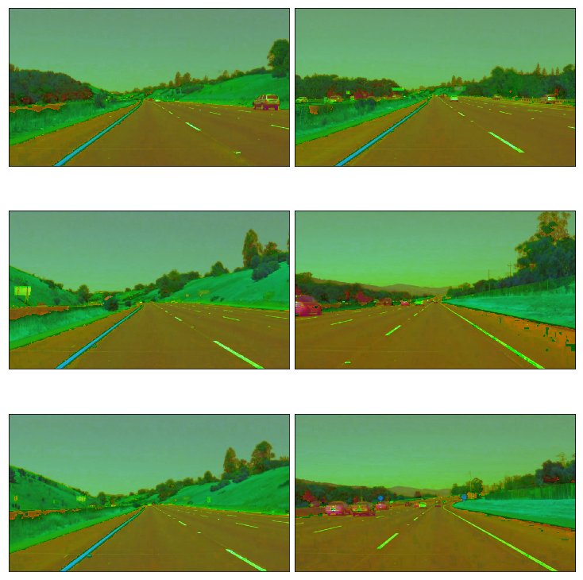
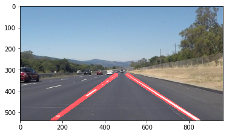

# Lane Detection - Project 1
Project requirements:
    1. Reliable Lane Detection
    2. Solid/Broken White/Yellow lane detection
   
Approach:
    1. The idea is to just filter out the Lanes which has a unique color(White & Yellow) & shape pattern(Line).
    2. Splitting the problem 
        1. Color Filtering
            Tried to solve it by converting the color spaces(HSV) which actually gave better results than RGB. Because the color factor comes under the one variable of HSV(Hue)
        2. Shape Filtering
            Lines can easily be detected using Hough Line detection.
        3. Region of Interest
            There is an ROI that we are interested in which is the are we care about in the image. Trapezoidal ROI is what has been tried to avoid noises.
            
I started of just using the Hough Lines Example, from the Quizzes. Then I wasn't satisfied with the results having multiple unwanted lines. I came across this github repository where they have used color filtering, which actually makes the system more stable. I took the report format from the following repository which is intuitive.

References Used for this Project:
    1. https://github.com/naokishibuya/car-finding-lane-lines
    2. https://github.com/udacity/CarND-LaneLines-P1/blob/master/P1.ipynb


# Importing the Basic Libraries and Reading the Test Images/Videos
Basic Functions, taken from the sample project to read Images and Videos.


```python
#importing some useful packages
import math
import matplotlib.pyplot as plt
import matplotlib.image as mpimg
import numpy as np
import cv2
import os,glob
from moviepy.editor import VideoFileClip
from IPython.display import HTML

%matplotlib inline


def plot_images(images, cmap=None):
    cols = 2
    rows = (len(images)+1)//cols
    
    plt.figure(figsize=(10, 11))
    for i, image in enumerate(images):
        plt.subplot(rows, cols, i+1)
        # use gray scale color map if there is only one channel
        cmap = 'gray' if len(image.shape)==2 else cmap
        plt.imshow(image, cmap=cmap)
        plt.xticks([])
        plt.yticks([])
    plt.tight_layout(pad=0, h_pad=0, w_pad=0)
    plt.show()
```

Testing the Image plot function by importing images from path.


```python
test_images = [plt.imread(path) for path in glob.glob('test_images/*.jpg')]

plot_images(test_images)
```


# Color Filtering 
   Converting the color space from RGB to HSL, for simplification. Hue is the only variable that has to be compared in HSL space.HSL color space is convenient because it is the way we humans percieve. 
   It can be done in RGB Color space as well but picking the color range would be a complicated process. in HSL/HSV it is just in the range of one variable.
    
   Using OpenCV Library functions to convert the color space, 


```python
def convert_colorspace(image):
    return cv2.cvtColor(image, cv2.COLOR_RGB2HLS)

plot_images(list(map(convert_colorspace, test_images)))
```





White Color,
   Outer Circle on HSL Space
      Ranges from [0,200,0],[255,255,255]
Yellow Color,
   Color Ranges according to http://colorizer.org/
      Ranges from [10,0,100],[40,255,255]


```python
def colorfilter_lane_lines(image):
    converted = convert_colorspace(image)
    # white color mask
    lower = np.uint8([  0, 200,   0])
    upper = np.uint8([255, 255, 255])
    white_mask = cv2.inRange(converted, lower, upper)
    # yellow color mask
    lower = np.uint8([ 10,   0, 100])
    upper = np.uint8([ 40, 255, 255])
    yellow_mask = cv2.inRange(converted, lower, upper)
    # combine the mask
    mask = cv2.bitwise_or(white_mask, yellow_mask)
    return cv2.bitwise_and(image, image, mask = mask)

laneColorFilteredImages = list(map(colorfilter_lane_lines, test_images))

plot_images(laneColorFilteredImages)
```


# Noise Filtering (Smoothing the Image)
The filtered Images are noisy and sharp as it may seem above. The images has to be smoothened to avoid the noises in the pixels. It can be achieved by Gaussian Smoothening Kernels. This is nothing but an convoluting the averaging kernel over the image. OpenCV has a function GaussianBlur which can do the smoothening.

# Gray Scale Conversion
It is easy to process an image in grayscale, because all we care about is the line not any other information. It reduces the computation complexity.

[OpenCV Reference: Gaussian Blur](https://docs.opencv.org/2.4/doc/tutorials/imgproc/gausian_median_blur_bilateral_filter/gausian_median_blur_bilateral_filter.html)


```python
def gaussian_blur_gray(img):
    kernel_size = 9
    """Applies a Gaussian Noise kernel"""
    blur = cv2.GaussianBlur(img, (kernel_size, kernel_size), 0)
    return cv2.cvtColor(blur, cv2.COLOR_RGB2GRAY)
smoothenedImages = list(map(gaussian_blur_gray,laneColorFilteredImages))
plot_images(smoothenedImages)
```


# Edge Detection (Canny/Sobel Filter)
Now we have a filtered image with Lanes and other things on the road (i.e Cars, Traffic Signs etc.) It is an important step in moving forward to filter out just the lane. Hough Lines would still detect these lanes but having an extra step like Canny will improve the accuracy.

Canny/Sobel both can be used for this purpose. Both uses difference kernel on x and y axis, which amplifies the difference. In this use case after multiple tries Canny seems to work well.

Canny operator takes two parameters, upper threshold and lower threshold. Both can be adjusted to get the optimal results. Higher the threshold, we will see less lines.


```python
def canny(img, low_threshold, high_threshold):
    """Applies the Canny transform"""
    return cv2.Canny(img, low_threshold, high_threshold)

edgeDetectedImages = list(map(lambda image: canny(image,40,160), smoothenedImages))
plot_images(edgeDetectedImages)

```


# Region of Interest
From cameras perspective we have the sky, the bridge etc., which we do not want to take into account. So we can filter them out by using a ROI mask. This mask will help us process the road alone.


```python
def region_of_interest(img):
    imshape = img.shape
    vertices = np.array([[(50,imshape[0]),(imshape[1]/2-50,imshape[0]/2+50), (imshape[1]/2+50,imshape[0]/2+50), (imshape[1]-50,imshape[0])]], dtype=np.int32)
    
    """
    Applies an image mask.
    
    Only keeps the region of the image defined by the polygon
    formed from `vertices`. The rest of the image is set to black.
    """
    #defining a blank mask to start with
    mask = np.zeros_like(img)   
    
    #defining a 3 channel or 1 channel color to fill the mask with depending on the input image
    if len(img.shape) > 2:
        channel_count = img.shape[2]  # i.e. 3 or 4 depending on your image
        ignore_mask_color = (255,) * channel_count
    else:
        ignore_mask_color = 255
        
    #filling pixels inside the polygon defined by "vertices" with the fill color    
    cv2.fillPoly(mask, vertices, ignore_mask_color)
    
    #returning the image only where mask pixels are nonzero
    masked_image = cv2.bitwise_and(img, mask)
    return masked_image

ROIImages = list(map(region_of_interest,edgeDetectedImages))
plot_images(ROIImages)
```


# Hough Lines
Hough Lines takes the image in xy space and convert them into ro,theta space. Which actually makes it simple to detect Lines as points in ro,theta space. By thresholding it, we can define the length of the lines. 

Parameters that can be tweaked in this transform:

    1.rho – Distance resolution of the accumulator in pixels.
    2.theta – Angle resolution of the accumulator in radians.
    3.threshold – Accumulator threshold parameter. Only those lines are returned that get enough votes (> threshold).
    4.minLineLength – Minimum line length. Line segments shorter than that are rejected.
    5.maxLineGap – Maximum allowed gap between points on the same line to link them. (Clustering a group of lines with certain gap)


```python
def hough_lines(img, rho, theta, threshold, min_line_len, max_line_gap):
    lines = cv2.HoughLinesP(img, rho, theta, threshold, np.array([]), minLineLength=min_line_len, maxLineGap=max_line_gap)
    return lines

rho = 2 # distance resolution in pixels of the Hough grid
theta = 3*np.pi/180 # angular resolution in radians of the Hough grid
threshold = 20     # minimum number of votes (intersections in Hough grid cell)
min_line_length = 20 #minimum number of pixels making up a line
max_line_gap = 200    # maximum gap in pixels between connectable line segments
list_of_lines = list(map(lambda image:hough_lines(image,rho,theta,threshold,min_line_length,max_line_gap), ROIImages))
```

Now the lines are visible, But it is not extrapolated as we want. So we will have to process the lines to draw two lines one with a negative slope and other with Positive slope. By averaging the ones which have negative slope and the ones which has the positive slope. We should be able to have one unique line on each side. 

# Average Slope (Left and Right Lane)
   From the points from Hough Lines, the slope can be calculated using 
   for a line y = mx + c (Where m is the slope and c is the intercept)
   m = (y2 - y1) / (x2 - x1) and intercept = y - mx
   Length of the line can be caluculated using distance formula. 


```python
def average_slope_intercept(lines):
    left_lines    = [] # (slope, intercept)
    left_weights  = [] # (length,)
    right_lines   = [] # (slope, intercept)
    right_weights = [] # (length,)
    
    for line in lines:
        for x1, y1, x2, y2 in line:
            if x2==x1:
                continue # ignore a vertical line
            slope = (y2-y1)/(x2-x1)
            intercept = y1 - slope*x1
            length = np.sqrt((y2-y1)**2+(x2-x1)**2)
            if slope < 0: # y is reversed in image
                left_lines.append((slope, intercept))
                left_weights.append((length))
            else:
                right_lines.append((slope, intercept))
                right_weights.append((length))
    
    # add more weight to longer lines    
    left_lane  = np.dot(left_weights,  left_lines) /np.sum(left_weights)  if len(left_weights) >0 else None
    right_lane = np.dot(right_weights, right_lines)/np.sum(right_weights) if len(right_weights)>0 else None
    
    return left_lane, right_lane # (slope, intercept), (slope, intercept)

def make_line_points(y1, y2, line):
    """
    Convert a line represented in slope and intercept into pixel points
    """
    if line is None:
        return None
    
    slope, intercept = line
    
    # make sure everything is integer as cv2.line requires it
    x1 = int((y1 - intercept)/slope)
    x2 = int((y2 - intercept)/slope)
    y1 = int(y1)
    y2 = int(y2)
    
    return ((x1, y1), (x2, y2))

def lane_lines(image, lines):
    left_lane, right_lane = average_slope_intercept(lines)
    
    y1 = image.shape[0] # bottom of the image
    y2 = y1*0.6         # slightly lower than the middle

    left_line  = make_line_points(y1, y2, left_lane)
    right_line = make_line_points(y1, y2, right_lane)
    
    return left_line, right_line

    
def draw_lane_lines(image, lines, color=[255, 0, 0], thickness=20):
    # make a separate image to draw lines and combine with the orignal later
    line_image = np.zeros_like(image)
    for line in lines:
        if line is not None:
            cv2.line(line_image, *line,  color, thickness)
    # image1 * α + image2 * β + λ
    # image1 and image2 must be the same shape.
    return cv2.addWeighted(image, 1.0, line_image, 0.95, 0.0)

lane_images = []
for image, lines in zip(test_images, list_of_lines):
    lane_images.append(draw_lane_lines(image, lane_lines(image, lines)))

    
plot_images(lane_images)
```


# Process Image
The Lines look good on Test Images. Lets write a single function which computes all the above in sequence.


```python
def process_image(img):
    imgCopy = img.copy()
    laneColorFilteredImage = colorfilter_lane_lines(img)
    smoothenedImage = gaussian_blur_gray(laneColorFilteredImage)
    cannyImage = canny(smoothenedImage,40,160)
    ROIImage = region_of_interest(cannyImage)
    
    rho = 2 # distance resolution in pixels of the Hough grid
    theta = 3*np.pi/180 # angular resolution in radians of the Hough grid
    threshold = 20     # minimum number of votes (intersections in Hough grid cell)
    min_line_length = 20 #minimum number of pixels making up a line
    max_line_gap = 200    # maximum gap in pixels between connectable line segments
    lines = hough_lines(ROIImage,rho,theta,threshold,min_line_length,max_line_gap)
    lane_line = lane_lines(imgCopy, lines)
    imgWithLanes = draw_lane_lines(imgCopy,lane_line)
    return imgWithLanes


image = plt.imread('test_images/solidWhiteRight.jpg')
plt.imshow(process_image(image))
```


    <matplotlib.image.AxesImage at 0x11724b550>





# Processing Video


```python
def process_video(filename,outputFilename):
    clip1 = VideoFileClip(filename)
    white_clip = clip1.fl_image(process_image) #NOTE: this function expects color images!!
    %time white_clip.write_videofile(outputFilename, audio=False)
```


```python
test_videos = [path for path in glob.glob('test_videos/*.mp4')]
i = 0
for video in test_videos:
    process_video(video,"test_videos_output/%d.mp4"%(i))
    i+=1
```

    [MoviePy] >>>> Building video test_videos_output/0.mp4
    [MoviePy] Writing video test_videos_output/0.mp4


    100%|█████████▉| 221/222 [00:06<00:00, 33.28it/s]


    [MoviePy] Done.
    [MoviePy] >>>> Video ready: test_videos_output/0.mp4 
    
    CPU times: user 5.2 s, sys: 769 ms, total: 5.96 s
    Wall time: 7.46 s
    [MoviePy] >>>> Building video test_videos_output/1.mp4
    [MoviePy] Writing video test_videos_output/1.mp4


    100%|██████████| 251/251 [00:17<00:00, 14.81it/s]


    [MoviePy] Done.
    [MoviePy] >>>> Video ready: test_videos_output/1.mp4 
    
    CPU times: user 11.4 s, sys: 2.27 s, total: 13.7 s
    Wall time: 19.3 s
    [MoviePy] >>>> Building video test_videos_output/2.mp4
    [MoviePy] Writing video test_videos_output/2.mp4


    100%|█████████▉| 681/682 [00:24<00:00, 25.23it/s]


    [MoviePy] Done.
    [MoviePy] >>>> Video ready: test_videos_output/2.mp4 
    
    CPU times: user 18.6 s, sys: 2.56 s, total: 21.1 s
    Wall time: 25.6 s


The code seems to work well for the sample videos and test images.

# Short Comings
1. It may not work well if there is a sharp curved road(We just detect straight lines here).
2. It may not work if there is snow on the road (Our color filter detects the whole road instead of just the lines)
3. Lighting might affect the results as well. If it is too dark to detect lines
4. Fog could be a possible shortcoming, becase we may not be able to detect the lines from a foggy image
5. Raining would be a special case too.

# Possible Improvements
1. May be use of thermal cameras on road, to detect black vs White/Yellow would help on those harsh climatic conditions. This is something that would be useful in cross verifying the camera lane output


Author: Surjith Bhagavath Singh

